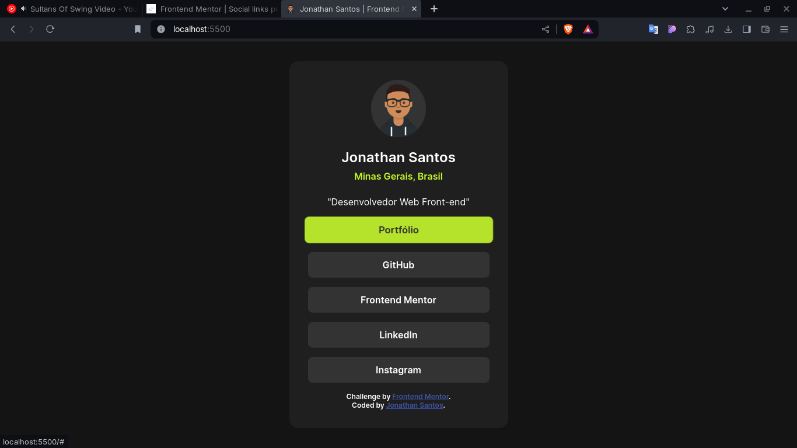

# Frontend Mentor - Solução do perfil de links sociais

Esta é uma solução para o desafio [Social links profile no Frontend Mentor](https://www.frontendmentor.io/challenges/social-links-profile-UG32l9m6dQ). Os desafios do Frontend Mentor ajudam você a melhorar suas habilidades de codificação ao construir projetos realistas.

## Sumário

- [Visão Geral](#visão-geral)
  - [O desafio](#o-desafio)
  - [Captura de tela](#captura-de-tela)
  - [Links](#links)
- [Meu processo](#meu-processo)
  - [Construído com](#construído-com)
  - [O que aprendi](#o-que-aprendi)
  - [Desenvolvimento contínuo](#desenvolvimento-contínuo)
  - [Recursos úteis](#recursos-úteis)
- [Autor](#autor)
- [Agradecimentos](#agradecimentos)

## Visão Geral

### O desafio

Os usuários devem ser capazes de:

- Ver estados de hover e focus para todos os elementos interativos na página.

### Captura de tela



### Links

- URL da Solução: [Adicione a URL da solução aqui](https://your-solution-url.com)
- URL do Site Ao Vivo: [Adicione a URL do site ao vivo aqui](https://your-live-site-url.com)

## Meu processo

### Construído com

- Marcação HTML5 semântica
- Propriedades personalizadas CSS
- Flexbox
- CSS Grid
- Fluxo de trabalho mobile-first
- [React](https://reactjs.org/) - Biblioteca JS
- [Next.js](https://nextjs.org/) - Framework React
- [Styled Components](https://styled-components.com/) - Para estilos

**Nota: Estes são apenas exemplos. Exclua esta nota e substitua a lista acima pelas suas próprias escolhas.**

### O que aprendi

Use esta seção para recapitular algumas das principais aprendizagens enquanto trabalhava neste projeto. Escrever sobre elas e fornecer trechos de código de áreas que deseja destacar é uma ótima maneira de reforçar seu próprio conhecimento.

Para ver como adicionar trechos de código, veja abaixo:

```html
<h1>Algum código HTML do qual me orgulho</h1>
```

```css
.orgulhoso-deste-css {
  color: papayawhip;
}
```

```js
const orgulhoDaProfissao = () => {
  console.log('🎉');
};
```

### Desenvolvimento contínuo

Use esta seção para destacar áreas nas quais você deseja continuar focando em projetos futuros. Isso pode incluir conceitos com os quais você ainda não está completamente confortável ou técnicas que achou úteis e deseja refinar e aprimorar.

**Nota: Exclua esta nota e o conteúdo desta seção e substitua pelas suas próprias planos de desenvolvimento contínuo.**

### Recursos úteis

- [Documentação <address> mdn](https://developer.mozilla.org/pt-BR/docs/Web/HTML/Element/address) - Isso me ajudou por não ter total certeza do uso desta tag HTML.

## Autor

- Site - [Adicione seu nome aqui](https://www.your-site.com)
- Frontend Mentor - [@yourusername](https://www.frontendmentor.io/profile/yourusername)
- Instagram - [@jonathan.go.santos](https://www.twitter.com/yourusername)

**Nota: Exclua esta nota e adicione/remova/edite as linhas acima com base nos links que você gostaria de compartilhar.**

## Agradecimentos

Aqui é onde você pode agradecer a quem o ajudou neste projeto. Talvez você tenha trabalhado em equipe ou tenha se inspirado na solução de outra pessoa. Este é o lugar perfeito para dar-lhes algum crédito.

**Nota: Exclua esta nota e edite o conteúdo desta seção conforme necessário. Se você completou este desafio sozinho, sinta-se à vontade para excluir esta seção inteiramente.**
