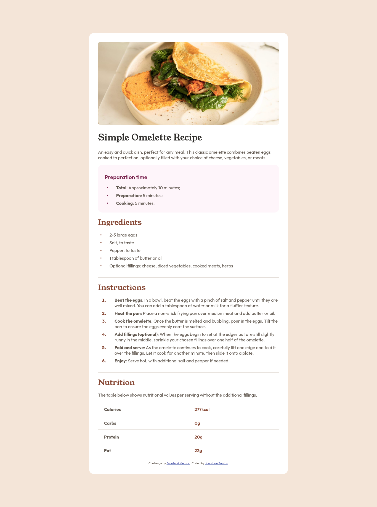

# Frontend Mentor - Solução da Página de Receita

Esta é uma solução para o desafio [Social links profile no Frontend Mentor](https://www.frontendmentor.io/challenges/social-links-profile-UG32l9m6dQ). Os desafios do Frontend Mentor ajudam você a melhorar suas habilidades de codificação ao construir projetos realistas.

## Sumário

- [Visão Geral](#visão-geral)
  - [O desafio](#o-desafio)
  - [Captura de tela](#captura-de-tela)
  - [Links](#links)
- [Meu processo](#meu-processo)
  - [Construído com](#construído-com)
  - [O que aprendi](#o-que-aprendi)
  - [Desenvolvimento contínuo](#desenvolvimento-contínuo)
  - [Recursos úteis](#recursos-úteis)
- [Autor](#autor)
- [Agradecimentos](#agradecimentos)

## Visão Geral

### Captura de tela

### Links

- URL da Solução: [GitHub](https://github.com/JonathanGOSantos/100daysofcode/tree/master/day2/recipe-page-main)
- URL do Site Ao Vivo: [GitHub Pages](https://jonathangosantos.github.io/100daysofcode/day2/recipe-page-main/)

## Meu Processo

### Construído com

- Marcação HTML5 semântica
- Propriedades customizadas CSS
- Flexbox
- Fluxo de trabalho mobile-first

### O que aprendi

Estilização do pseudo-elemento `::marker` do css.

### Desenvolvimento contínuo

Pseudo elemento `::before` e `::after` são os que mais vou focar para os proximos aprendizados.

### Recursos úteis

- [Documentação `::before`](hhttps://developer.mozilla.org/en-US/docs/Web/CSS/::before) - Isso me ajudou a criar o dot do li customizado e centralizado.
- [Documentação `::marker`](https://developer.mozilla.org/en-US/docs/Web/CSS/::marker) - Isso me ajudou a customizar os números da lista ordenada.
- [Documentação `:last-child`](https://developer.mozilla.org/pt-BR/docs/Web/CSS/:last-child) - Isso me ajudou a remover a borda da ultima linha da tabela.

## Autor

- Site - [Jonathan Santos](https://jonathangosantos.netlify.app/)
- Frontend Mentor - [@JonathanGOSantos](https://www.frontendmentor.io/profile/JonathanGOSantos)
- Instagram - [@jonathan.go.santos](https://www.instagram.com/jonathan.go.santos/)