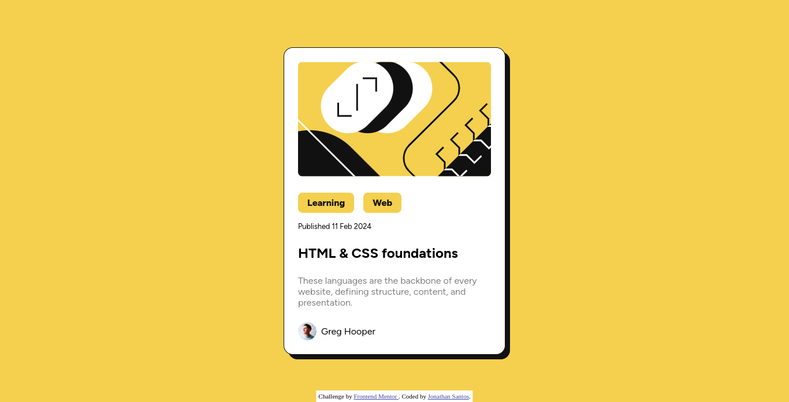
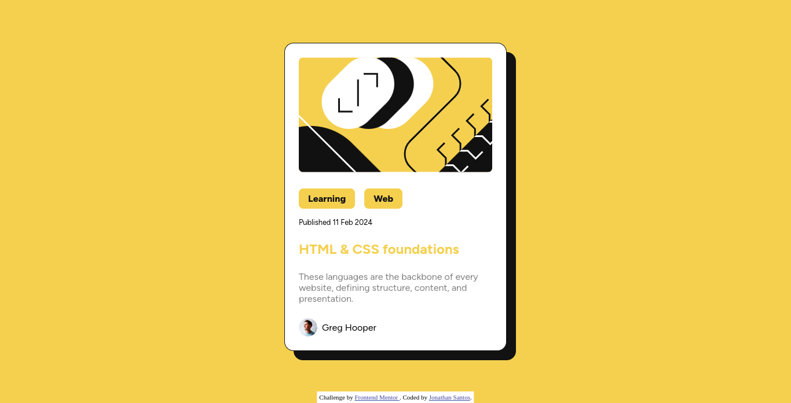

# Frontend Mentor - Solução para o desafio do cartão de pré-visualização de blog

Esta é uma solução para o [desafio do cartão de pré-visualização de blog no Frontend Mentor](https://www.frontendmentor.io/challenges/blog-preview-card-ckPaj01IcS). Os desafios do Frontend Mentor ajudam você a aprimorar suas habilidades de codificação ao construir projetos realistas.

## Sumário

- [Visão Geral](#visão-geral)
  - [O desafio](#o-desafio)
  - [Captura de tela](#captura-de-tela)
  - [Links](#links)
- [Meu processo](#meu-processo)
  - [Construído com](#construído-com)
  - [O que aprendi](#o-que-aprendi)
  - [Recursos úteis](#recursos-úteis)
- [Autor](#autor)

## Visão Geral

### Captura de tela
> Normal

> Hover

### Links

- URL da Solução: [GitHub](https://github.com/JonathanGOSantos/100daysofcode/tree/master/daye/blog-preview-card-main)
- URL do Site Ao Vivo: [GitHub Pages](https://jonathangosantos.github.io/100daysofcode/daye/blog-preview-card-main/)

## Meu Processo

### Construído com

- Marcação HTML5 semântica
- Propriedades customizadas CSS
- Flexbox
- Fluxo de trabalho mobile-first

### O que aprendi

- A utilização da tag `<time>` do html 

### Recursos úteis

- [Documentação `<time>`](https://developer.mozilla.org/en-US/docs/Web/HTML/Element/time) - Isso me ajudou a definir a data de criação do post;

## Autor

- Site - [Jonathan Santos](https://jonathangosantos.netlify.app/)
- Frontend Mentor - [@JonathanGOSantos](https://www.frontendmentor.io/profile/JonathanGOSantos)
- Instagram - [@jonathan.go.santos](https://www.instagram.com/jonathan.go.santos/)