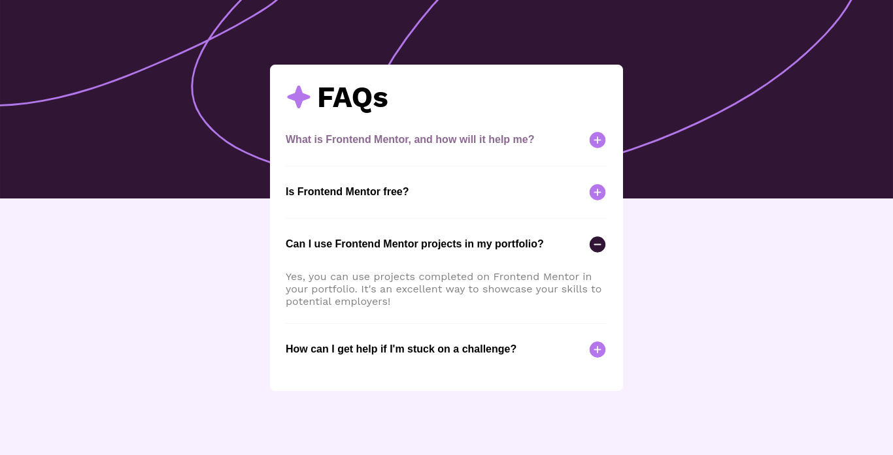
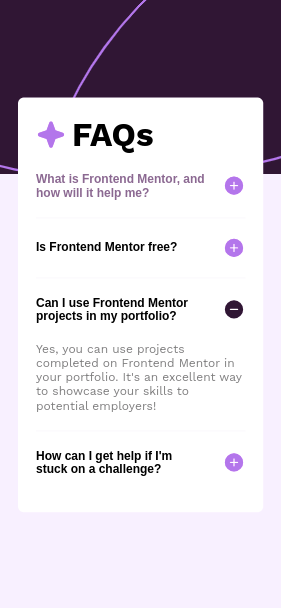

# Frontend Mentor - Solução para o acordeão de perguntas frequentes

Esta é uma solução para o [desafio de acordeão de perguntas frequentes no Frontend Mentor](https://www.frontendmentor.io/challenges/faq-accordion-wyfFdeBwBz). Os desafios do Frontend Mentor ajudam você a melhorar suas habilidades de codificação ao construir projetos realistas.

## Sumário

- [Visão Geral](#visão-geral)
  - [O desafio](#o-desafio)
  - [Captura de tela](#captura-de-tela)
  - [Links](#links)
- [Meu processo](#meu-processo)
  - [Construído com](#construído-com)
  - [Recursos úteis](#recursos-úteis)
- [Autor](#autor)

## Visão Geral

### O Desafio

Os usuários devem ser capazes de:

- Ocultar/Mostrar a resposta de uma pergunta quando a pergunta é clicada
- Navegar pelas perguntas e ocultar/mostrar respostas usando apenas a navegação pelo teclado
- Visualizar o layout ideal para a interface, dependendo do tamanho da tela do seu dispositivo
- Ver estados de hover e foco para todos os elementos interativos na página

### Captura de Tela

### Links

- URL da Solução: [GitHub](https://github.com/JonathanGOSantos/100daysofcode/tree/master/day4/faq-accordion-main/)
- URL do Site Ao Vivo: [GitHub Pages](https://jonathangosantos.github.io/100daysofcode/day4/faq-accordion-main/)

## Meu Processo

### Construído com

- Marcação HTML5 semântica
- Propriedades personalizadas de CSS
- Flexbox
- CSS Grid
- Fluxo de trabalho mobile-first

## Autor

- Site - [Jonathan Santos](https://jonathangosantos.netlify.app/)
- Frontend Mentor - [@JonathanGOSantos](https://www.frontendmentor.io/profile/JonathanGOSantos)
- Instagram - [@jonathan.go.santos](https://www.instagram.com/jonathan.go.santos/)
