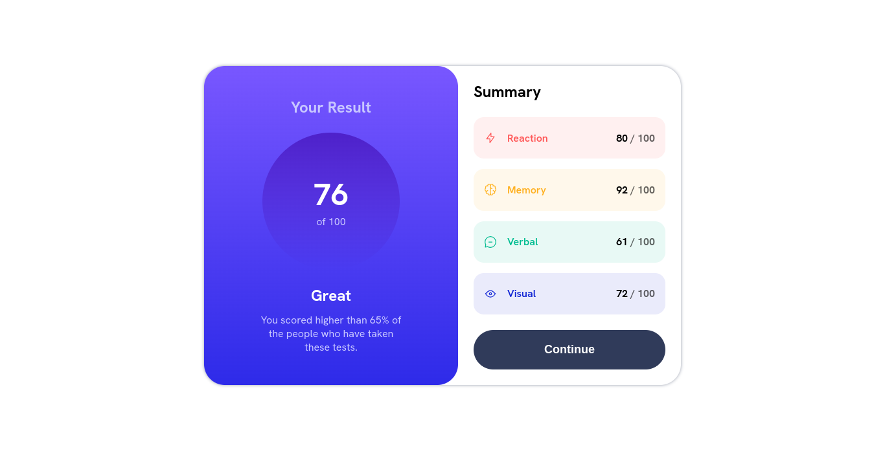

# Frontend Mentor - Solução do componente de resumo de resultados

Esta é uma solução para o desafio do [componente de resumo de resultados no Frontend Mentor](https://www.frontendmentor.io/challenges/results-summary-component-CE_K6s0maV). Os desafios do Frontend Mentor ajudam a aprimorar suas habilidades de codificação ao construir projetos realistas.

## Sumário

- [Visão Geral](#visão-geral)
  - [O desafio](#o-desafio)
  - [Captura de tela](#captura-de-tela)
  - [Links](#links)
- [Meu processo](#meu-processo)
  - [Desenvolvido com](#desenvolvido-com)
  - [O que aprendi](#o-que-aprendi)
- [Autor](#autor)

## Visão Geral

### O desafio

Os usuários devem ser capazes de:

- Visualizar o layout ideal para a interface, dependendo do tamanho da tela do seu dispositivo
- Ver estados de hover e foco para todos os elementos interativos na página
- **Bônus**: Usar os dados locais em JSON para popular dinamicamente o conteúdo

### Captura de tela



### Links

- URL da Solução: [Github](https://github.com/JonathanGOSantos/100daysofcode/tree/master/day5/results-summary-component-main)
- URL do Site ao Vivo: [Github Pages](https://jonathangosantos.github.io/100daysofcode/day5/results-summary-component-main/)

## Meu processo

### Desenvolvido com

- Marcação HTML5 semântica
- Propriedades personalizadas CSS
- Flexbox
- CSS Grid
- Fluxo de trabalho mobile-first
- JavaScript

### O que aprendi

Como eu estava usando o live server para fazer um mini servidor para fazer o projeto o caminho para o data.json era `/js/data.json`, porém, no meu github tem uma pasta pai então `/js/data.json/` já não funcionava então tive que encontrar uma forma de verificar qual a url atual e se começasse com `http://local` então a URL seria `/js/data.json`, se não seria o caminho completo do github e para isso usei o `window.location.href` que retorna a url atual no navegador.

```js
const recebeDados = () => {
  let url = '/100daysofcode/day5/results-summary-component-main/js/data.json'; // URL padrão

  // Se for localhost então a URL muda, se não só pula este bloco
  if (window.location.href.startsWith('http://localhost')) {
    url = '/js/data.json';
  }

  fetch(url);
  //resto do código
};
```

## Autor

- Site - [Jonathan Santos](https://jonathangosantos.netlify.app/)
- Frontend Mentor - [@JonathanGOSantos](https://www.frontendmentor.io/profile/JonathanGOSantos)
- Instagram - [@jonathan.go.santos](https://www.instagram.com/jonathan.go.santos/)
