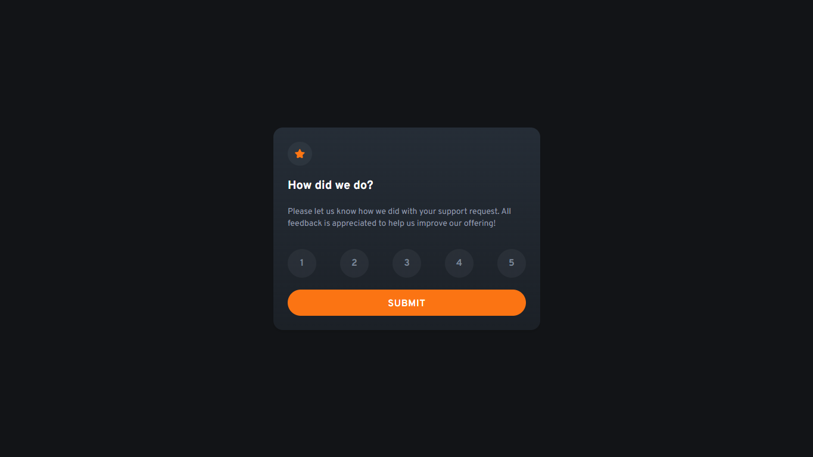

# Frontend Mentor - Solução do componente de avaliação interativa

Esta é uma solução para o desafio do [componente de avaliação interativa no Frontend Mentor](https://www.frontendmentor.io/challenges/interactive-rating-component-koxpeBUmI). Os desafios do Frontend Mentor ajudam a melhorar suas habilidades de codificação, permitindo que você construa projetos realistas.

## Sumário

- [Visão Geral](#visão-geral)
  - [O desafio](#o-desafio)
  - [Captura de tela](#captura-de-tela)
  - [Links](#links)
- [Meu Processo](#meu-processo)
  - [Desenvolvido com](#desenvolvido-com)
  - [O que aprendi](#o-que-aprendi)
  - [Desenvolvimento futuro](#desenvolvimento-futuro)
  - [Recursos úteis](#recursos-úteis)
- [Autor](#autor)
- [Agradecimentos](#agradecimentos)

## Visão Geral

### O desafio

Os usuários devem ser capazes de:

- Ver o layout ideal para o aplicativo, dependendo do tamanho da tela do dispositivo
- Ver estados de hover para todos os elementos interativos na página
- Selecionar e enviar uma avaliação numérica
- Ver o estado do "Obrigado" após enviar uma avaliação

### Captura de tela

### Links

- URL da Solução: [GitHUb](https://github.com/JonathanGOSantos/100daysofcode/tree/master/day7/interactive-rating-component-main)
- URL do Site Ao Vivo: [Netlify](https://jonathansantos-interactive-rating.netlify.app/)

## Meu Processo

### Desenvolvido com

- Marcação HTML5 semântica
- Propriedades personalizadas CSS
- Flexbox
- Fluxo de trabalho "mobile-first"
- [Vite](https://vitejs.dev/) - Ambiente de desenvolvimento front-end
- [Tailwind CSS](https://tailwindcss.com/) - Para estilos

### O que aprendi

Como citado anteriormente usei Tailwind CSS e Vite neste projeto, O Vite já tinha visto antes porém tailwind foi a primeira vez que usei e a documentação foi um grande aliado.

### Desenvolvimento futuro

Planejo continuar estudando o Tailwind e a melhor forma de aplica-lo junto com interatividade com JS

### Recursos úteis

- [Vite Docs](https://vitejs.dev/guide/) - Isso me ajudou por XYZ motivo. Gostei muito desse padrão e o utilizarei no futuro.
- [Tailwind CSS Docs](https://tailwindcss.com/docs) - Este é um artigo incrível que finalmente me ajudou a entender XYZ. Eu recomendaria a qualquer pessoa que ainda está aprendendo esse conceito.

## Autor

- Site - [Jonathan Santos](https://jonathangosantos.netlify.app/)
- Frontend Mentor - [@JonathanGOSantos](https://www.frontendmentor.io/profile/JonathanGOSantos)
- Instagram - [@jonathan.go.santos](https://www.instagram.com/jonathan.go.santos/)
